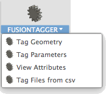

# FusionTagger

A set of utilities for working with custom attributes.

Apply Attributes to either:
* 3D geometry manually
* All User defined parameters
* Components based on importing a csv file

Attributes are available in Fusion 360 as a developer tool.

To learn more about attributes [read this article](http://help.autodesk.com/view/fusion360/ENU/?guid=GUID-BAF017FE-10B8-4612-BDE2-0EF5D4C6F800)

# Installation
[Click here to download the Add-in](https://github.com/tapnair/FusionTagger/archive/master.zip)

After downloading the zip file follow the [installation instructions here](https://tapnair.github.io/installation.html) for your particular OS version of Fusion 360

# Usage
Better documentation to come later. For now:

### Tag Geomtery
 - Select any geometry (Bodies, components, edges, occurrences, etc.)
 - Apply a Group Name, Attribute Name and Value
 - You can use the View Attributes command to verify it was applied successfully

### Tag Parameters
 - Will apply the give group and attribute name to all user defined parameters
 - The value of the parameter will be the current name of the parameter

_This is particularly useful when importing models and changing parameter values.
Fusion 360 will renmae the parameters in a model if they already exist in the assembly.
Using this technique you can still "find" parameters in a model based on their original names._

### View Attributes
 - Used to view attributes that have been applied in your model.
 - Type the value of the group or attribute you want to find in the document.
 - Leave blank for all values.  Basically find all parameters of specific group

### Tag Files From CSV
 - Very useful to tag many documents with a particular set of attributes
 - Currently works with a csv file
 - csv must have column named "Part Number" this will be matched to document name
 - Add-in iterates all documents in current active project and compares them to rows in the csv
 - If the document name matches "Part Number" column value attributes are applied to the root component of the document
 - Attribute name is based on column header and value is the value in that row.
 - Group is explicitly defined.
 - Path to csv must be set as well.

## License
Samples are licensed under the terms of the [MIT License](http://opensource.org/licenses/MIT). Please see the [LICENSE](LICENSE) file for full details.

## Written by

Written by [Patrick Rainsberry](https://twitter.com/prrainsberry)   (Autodesk Fusion 360 Business Development)

See more useful add-ins [Fusion 360 Utilities](https://tapnair.github.io/index.html)

